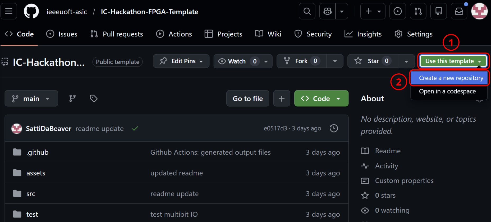
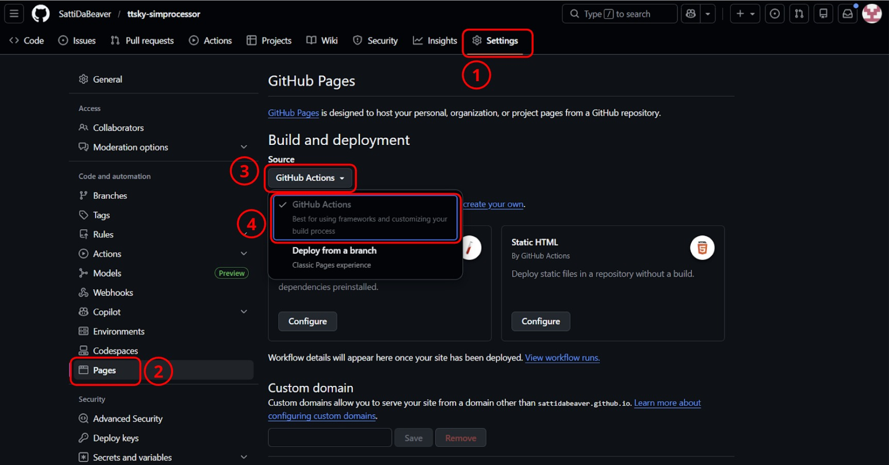
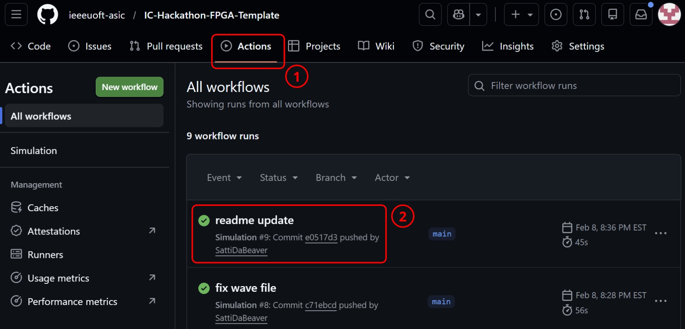
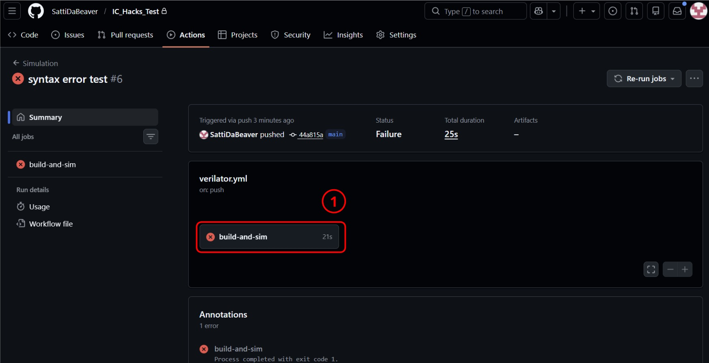

# IC Hacks (FPGA Track) Template Guide
This template provies an easy to use Verilog/SystemVerilog simulation workflow, managed entirely through github actions. 

## Template Overview
This repository serves as the official template for the **FPGA Track**. Participants should use this template to structure their Verilog/SystemVerilog projects and testbenches.

When submitting your project, provide the link to your repository based on this template (see instructions below). This ensures that your simulation workflow, waveform generation, and GitHub Actions outputs work correctly.

### IMPORTANT NOTE
Only modify the `/src` and the `/test` directories. **DO NOT** modify files in any other directory. Modifying other files **WILL** break the simulation workflow and may also lead to merge conflicts.

See the `Expected Repository Structure` section below.

# How to use the Repository

### Clone and Prepare the Repository
Click `Use this template` &rarr; `Create a new repository`. Make the repository **public** for submission.



### Enable GitHub Actions to Build the Results Page
Go to your newly created repository and allow actions to create GitHub pages.

`Settings` &rarr; `Pages` &rarr; `Build and Deployment` &rarr; `GitHub Actions`



## Set up your Verilog/Systemverilog Project

1. Add your Verilog/Systemverilog source files to the `/src`. A  wrapper for the DE1-SoC FPGA board is provided at `/src/de1soc_wrapper.sv`. The top module name in `/src` must match the one instantiated in `tb.sv`.

2. Add your testbench to `/test/tb.sv`. The testbench module must be named `tb`. 
   
    Every testbench must contain the following lines of code:
    ```
    initial begin
        $dumpfile("sim_out/wave.vcd");
        $dumpvars(0, tb);
    end
    ```
    This is required to generate the waveforms.

## Expected Repository Structure
```
│
├── src/            # ALL design source files (.v or .sv)
│ ├── top.sv
│ ├── module_a.v
│ └── ...
│
├── test/
│ └── tb.sv         # MUST be named exactly tb.sv
│
├── assets/         # Images for README
│
├── .github/
│ ├── workflows/    # GitHub Actions (do not modify)
│ └── outputs/      # Auto-generated simulation outputs
│
└── README.md
```

# Push your Repository and View Actions
Once you push the repository, it will trigger a GitHub Action workflow that runs the simulation and generates the output files.

Once your design passes the testbench, you can view the outputs under:

`Actions` &rarr; `<name of your last commit>`



## Viewing Your Waveforms
You can view the outputs generated by the actions in `.github/outputs/`. 
- `sim.log`: verilator text output
- `wave.vcd`: waveform file (can view in surfer)
- `wave.svg`: image preview of the waveform
- `wave.json`: used to generate the image preview (don't worry about this)

A preview of your waveform will also be generated in the **Actions Summary**. 


If you want to inspect the waveforms more closely you can use `surfer`:
1. Go to https://app.surfer-project.org/
2. `Files` &rarr; `Open URL` &rarr; `<URL to your wave.vcd (autogenerated)>`

The URL to your `wave.vcd` file will be generated automatically in the **Actions Summary**.

## Debugging
If your run failed, you review the workflow to identify the error.

Open the `build-and-sim` job and view where the workflow failed.

Errors should only occur in the `Run SV Testbench` section. If the failure happens in any other section **contact a moderator**.

Here is an example where there is a syntax error in the source file.



**NOTE:** Always check both `sim.log` and the waveforms to ensure your design works as expected. The workflow does **not** fail on assertion errors, they are only printed in `sim.log`.
